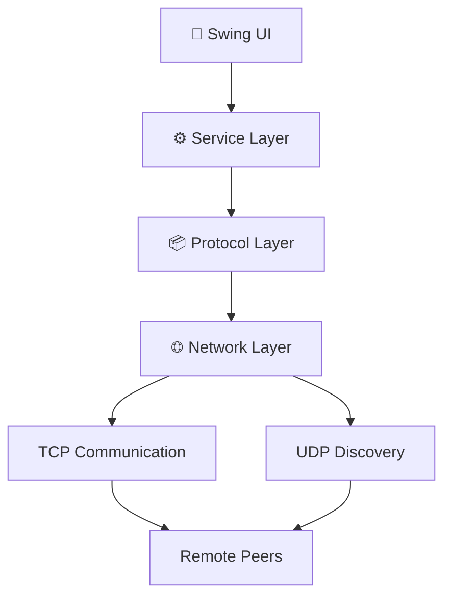

# 🎨 Java Network Whiteboard

<p align="center">


</p>

<p align="center">

A production-oriented Java networking project demonstrating **TCP/UDP Socket Programming**, **Multithreading**, **Concurrent Programming**, and **Application-layer Protocol Design** through a collaborative whiteboard application.

</p>

---

# 📖 Project Overview

Java Network Whiteboard is a **real-time collaborative whiteboard** built using **Java Core**, **TCP Socket**, **UDP Multicast**, and **Swing**.

Unlike traditional CRUD backend projects, this project focuses on **network programming fundamentals**, including reliable TCP communication, UDP peer discovery, concurrent client handling, and custom application-layer protocol design.

The goal of this project is to demonstrate practical software engineering skills that are commonly required for Java Software Engineer and Backend Engineer positions.

---

# ✨ Key Features

### 🎨 Collaborative Whiteboard

- Real-time drawing synchronization
- Multi-user whiteboard
- Canvas clear synchronization

### 💬 Chat System

- Real-time messaging
- User join / leave notification
- Thread-safe message handling

### 🌐 Networking

- TCP Socket communication
- UDP Multicast peer discovery
- Client / Server architecture
- Custom application-layer protocol

### ⚙ Concurrency

- ExecutorService thread pool
- ConcurrentHashMap
- Graceful shutdown
- Thread-safe services

---

# 🛠 Tech Stack

| Category | Technology |
|-----------|------------|
| Language | Java 17 |
| Build Tool | Maven |
| Networking | TCP Socket, UDP Multicast |
| UI | Swing |
| Concurrency | ExecutorService, ConcurrentHashMap |
| Testing | JUnit 5 |
| Version Control | Git / GitHub |

---

# 🏗 Architecture



---

# 📂 Project Structure

```text
src
└── main
    └── java
        └── com
            └── hanyao
                └── whiteboard
                    │
                    ├── Main.java
                    │
                    ├── config
                    │
                    ├── model
                    │   ├── Peer.java
                    │   ├── DrawCommand.java
                    │   └── ChatMessage.java
                    │
                    ├── protocol
                    │   ├── Message.java
                    │   ├── MessageType.java
                    │   └── MessageCodec.java
                    │
                    ├── network
                    │   ├── TcpServer.java
                    │   ├── TcpClient.java
                    │   ├── ClientHandler.java
                    │   └── UdpDiscoveryService.java
                    │
                    ├── service
                    │   ├── DrawingService.java
                    │   ├── ChatService.java
                    │   └── PeerService.java
                    │
                    ├── ui
                    │
                    └── util
```

---

# 🌐 Network Design

## TCP Communication

TCP is responsible for reliable message delivery.

### Supported Messages

- JOIN
- LEAVE
- DRAW
- CHAT
- CLEAR
- PING
- PONG

---

## UDP Peer Discovery

UDP is responsible for peer discovery only.

When a server starts:

```
Broadcast JOIN

↓

Peers receive discovery packet

↓

PeerService registers server

↓

Client establishes TCP connection
```

Drawing and chat messages are **never** transmitted through UDP.

---

# 📦 Application-layer Protocol

```
JOIN|username|ip|port

LEAVE|username

DRAW|x1|y1|x2|y2|color|strokeWidth

CHAT|username|message

CLEAR|username

PING|username

PONG|username
```

All protocol parsing is centralized inside **MessageCodec**, ensuring that UI and networking layers remain independent from protocol details.

---

# 🔄 Drawing Synchronization Flow

```text
User Draw

      │

      ▼

DrawingService

      │

      ▼

MessageCodec

      │

      ▼

TCP Client

      │

      ▼

Network

      │

      ▼

TCP Server

      │

      ▼

MessageCodec

      │

      ▼

DrawingService

      │

      ▼

Canvas Update
```

---

# 🧵 Concurrency Design

The application adopts a thread-safe architecture.

### TCP Server

- Dedicated accept thread
- Client handler thread pool
- Graceful shutdown

### TCP Client

- Listener thread
- Send queue
- Safe disconnect

### Shared State

- ConcurrentHashMap
- CopyOnWriteArrayList

### Thread Pool

- ExecutorService
- No manual thread creation for each request

---

# 🚀 Getting Started

## Clone Repository

```bash
git clone https://github.com/hanyao-dev/java-network-whiteboard.git
```

---

## Build

```bash
mvn clean compile
```

---

## Run Tests

```bash
mvn test
```

---

## Start Server

```bash
mvn exec:java "-Dexec.args=--server 5050 alice"
```

---

## Start Client

```bash
mvn exec:java "-Dexec.args=--connect localhost 5050 bob"
```

---

# 📈 Roadmap

## ✅ Completed

- Maven Project
- Layered Architecture
- Java Socket Programming
- TCP Communication
- UDP Discovery
- Message Protocol
- Swing UI
- Multithreading
- Thread-safe Services

---

## 🚧 In Progress

- Whiteboard synchronization
- Chat synchronization
- Peer discovery optimization
- Unit testing

---

## 🔜 Future Improvements

- Undo / Redo
- Image sharing
- File transfer
- Authentication
- TLS encryption
- Connection retry
- Heartbeat timeout detection
- GitHub Actions CI
- Docker packaging

---

# 📸 Screenshots

## Whiteboard

> *(Coming Soon)*

---

## Chat

> *(Coming Soon)*

---

## Multi-client Demo

> *(Coming Soon)*

---

# 💼 Resume Highlights

- Designed a layered Java networking application using TCP and UDP sockets.
- Developed a custom application-layer protocol with centralized message encoding and decoding.
- Implemented multithreaded client/server communication using ExecutorService.
- Applied thread-safe data structures including ConcurrentHashMap and CopyOnWriteArrayList.
- Built a modular architecture separating UI, Service, Protocol, and Network layers.
- Implemented peer discovery using UDP multicast while reserving TCP for reliable communication.

---

# 🎯 Skills Demonstrated

✅ Java Core

✅ Socket Programming

✅ TCP Networking

✅ UDP Networking

✅ Multithreading

✅ Concurrent Programming

✅ ExecutorService

✅ ConcurrentHashMap

✅ Client / Server Architecture

✅ Application-layer Protocol Design

✅ Swing GUI

✅ Maven

✅ Software Architecture

---

# 📚 What I Learned

This project strengthened my understanding of:

- Java Socket Programming
- Reliable vs Unreliable Network Communication
- TCP vs UDP trade-offs
- Concurrent Programming
- Thread-safe application design
- Layered Software Architecture
- Application-layer Protocol Design
- Client / Server System Design

---

# 📄 License

This project is licensed under the MIT License.

---

<p align="center">

⭐ If you found this project helpful, feel free to give it a star!

</p>